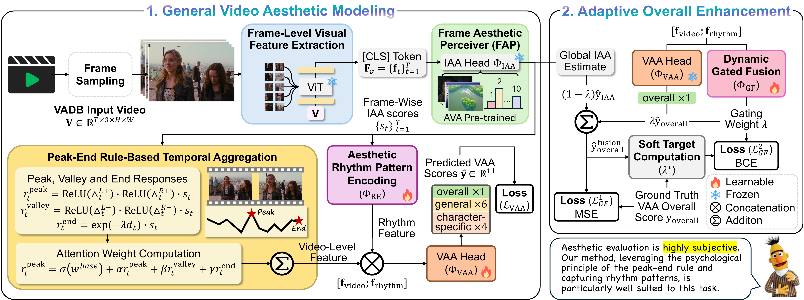

# Peak-End Net

**[ACM MM 2026] Peak-End Net: A Peak-End Rule Inspired Framework for Generalizable Video Aesthetic Assessment**

## Overview

Peak-End Net is a video aesthetic assessment framework inspired by the **Peak-End Rule** from psychology, which posits that humans judge an experience based on its most intense moment (peak) and its ending, rather than the average of the entire experience.

### Architecture



### Key Components

- **Frame Aesthetic Perceiver**: Predicts 10-class aesthetic distributions per frame and discovers key moments (peak, valley, end) via attention-weighted scoring.
- **Peak-End Aggregation**: Three-channel non-uniform temporal aggregation — peak channel (top-k moments), contrast channel (peak-to-valley contrast), and end channel (recency-weighted ending).
- **Rhythm Encoder**: Multi-scale 1D CNN (kernel sizes 3, 5, 7) capturing temporal aesthetic rhythm patterns.

## Installation

```bash
# Clone the repository
git clone https://github.com/AMAP-ML/Peak-End-Net.git
cd Peak-End-Net

# Install dependencies
pip install -r requirements.txt
```

### Requirements

- Python >= 3.8
- PyTorch >= 1.12.0
- CUDA-compatible GPU(s)

## Data Preparation

### 1. Extract Video Frames (Optional)

Pre-extract frames for faster training (optional, implement as needed).

### 2. Prepare Data Files

- **train_csv**: CSV file with training video paths and aesthetic scores (11 columns: overall + 6 general + 4 human)
- **val_csv**: CSV file with validation video paths and aesthetic scores
- **video_paths_json**: JSON mapping video IDs to file paths

## AVA Aesthetic Head Pretraining

Peak-End Net uses a **frozen CLIP ViT-L/14 image aesthetic head** (trained on the [AVA dataset](https://github.com/mtobeiyf/ava_downloader)) as its per-frame aesthetic perceiver. This head is trained **first**; the resulting `best_model.pth` is then passed to the main training via `--ava_checkpoint_path`.

### AVA Data Format

A space-separated label file (`AVA.txt`) where each row is:

```
index image_id count_1 count_2 ... count_10 [extra columns...]
```

`count_i` is the number of votes for aesthetic score `i` (1-10). Images are stored as `{image_id}.jpg` under `--img_dir`.

### Train the AVA Head (Multi-GPU DDP)

```bash
torchrun --nproc_per_node=8 ava_pretrain/train_ava_model.py \
    --img_dir /path/to/AVA/images \
    --csv_file /path/to/AVA.txt \
    --clip_model ViT-L/14 \
    --batch_size 64 \
    --epochs 20 \
    --lr 1e-4 \
    --save_dir ./checkpoints
```

The CLIP backbone is frozen; only the 10-class distribution head is trained with an Earth Mover's Distance (EMD) loss. The best checkpoint (by validation SROCC) is saved to `./checkpoints/best_model.pth` and later reused as the frozen frame scorer in Peak-End Net.

## Training

Peak-End Net is trained in **two stages**:

1. **Stage 1** — train the Peak-End modules (Key Moment Discovery, Peak-End Aggregation, Rhythm Encoder, Scoring Network) with the CLIP encoder and the AVA head frozen.
2. **Stage 2** — freeze all Stage-1 parameters and train only the lightweight Gated Fusion module, which adaptively balances the Stage-1 model score (`S_model`) and the average frame-level AVA score (`S_static`).

### Stage 1: Peak-End Net

#### Single GPU

```bash
python train.py \
    --train_csv /path/to/train.csv \
    --val_csv /path/to/val.csv \
    --video_paths_json /path/to/video_paths.json \
    --ava_checkpoint_path ./checkpoints/best_model.pth \
    --output_dir ./output \
    --epochs 30 \
    --lr 1e-3 \
    --batch_size_train 16 \
    --batch_size_val 8
```

#### Multi-GPU (DDP)

```bash
torchrun --nproc_per_node=4 train.py \
    --train_csv /path/to/train.csv \
    --val_csv /path/to/val.csv \
    --video_paths_json /path/to/video_paths.json \
    --ava_checkpoint_path ./checkpoints/best_model.pth \
    --output_dir ./output \
    --epochs 30 \
    --lr 1e-3 \
    --batch_size_train 64 \
    --batch_size_val 32
```

### Stage 2: Gated Fusion

Uses a trained Stage-1 checkpoint (`--stage1_checkpoint`) as the frozen base and trains only the gated fusion module:

```bash
torchrun --nproc_per_node=4 train_stage2.py \
    --stage1_checkpoint ./output/peakaes_stage1_best.pth \
    --ava_checkpoint_path ./checkpoints/best_model.pth \
    --train_csv /path/to/train.csv \
    --val_csv /path/to/val.csv \
    --video_paths_json /path/to/video_paths.json \
    --output_dir ./output_stage2 \
    --epochs 15 \
    --lr 1e-3 \
    --warmup_epochs 2 \
    --gate_loss_weight 1.0 \
    --batch_size_train 16 \
    --batch_size_val 32
```

The best checkpoint is saved as `stage2_best.pth` (trainable fusion weights only).

## Pretrained Model

The pretrained Peak-End Net checkpoint is available on Hugging Face:

**[GD-ML/Peak-End-Net](https://huggingface.co/GD-ML/Peak-End-Net/tree/main)**

`Peak-End-Net.pth` is a self-contained checkpoint that includes the full model weights (CLIP ViT-L/14 encoder, AVA aesthetic head, Peak-End modules, and the gated fusion module).

```bash
# Download via huggingface_hub
huggingface-cli download GD-ML/Peak-End-Net Peak-End-Net.pth --local-dir ./checkpoints
```

## Inference

Run inference on a single video with the self-contained checkpoint (no external AVA / Stage-1 files needed):

```bash
python inference.py \
    --checkpoint ./checkpoints/Peak-End-Net.pth \
    --video /path/to/video.mp4
```


## Citation

If you find this work useful, please cite:

```bibtex
@inproceedings{peak_end_net_2026,
  title={Peak-End Net: A Peak-End Rule Inspired Framework for Generalizable Video Aesthetic Assessment},
  author={Li, Geng and Li, Haiwen and Chen, Rui and Tang, Jing and Sun, Lei and Chu, Xiangxiang},
  booktitle={ACM International Conference on Multimedia (ACM MM)},
  year={2026}
}
```

## Acknowledgments

- [CLIP](https://github.com/openai/CLIP) by OpenAI
- [CLIP4Clip](https://github.com/ArrowLuo/CLIP4Clip) for the video-text encoder backbone
